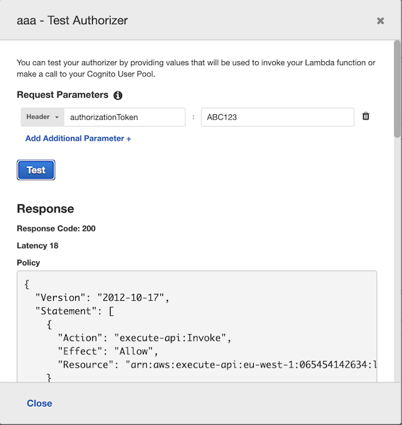

### Goal

- [X] Implement a Gateway with lambda authentication in the simplest possible way

### Description
The idea of this scenario is an API gateway that serves an endpoint from a lambda. This endpoint is protected by a custom lambda authorization (a second lambda) that verifies first
if the user has provided the required credentials in the header. Credentials are:
`header: authorizationToken: ABC123`

The way this lambda-auth works is: depending on if the request comes with the correct authorization token or not, it returns a policy document that will grant permissions or not to access the resource (the second lambda)

With this policy document the api gateway calls the second lambda.

### How to execute
The way to test this is by calling the gateway externally from Internet, using postman or the `get_welcome.rest` file (rest client extension in vscode). Keep in mind that every time the gateway gets deployed it changes its dynamic invoke URL, that can be found in the `stages` section

Using the aws API gateway console will not work because we would be bypassing the authorization lambda and calling directly the resource lambda, so avoid this:

Another way of testing the auth-lambda is using the `authorizers` section to query it directly.

If we dont provide a correct token it should return a `Deny` policy document

...While whereas we provide the `ABC123` token is should come back with the `Allow` policy document

The result of querying the gateway endpoint from postman can be saw here, when the token is provided:

...and when the token is not correct

### References
- What is API Gateway? Steps: https://www.youtube.com/watch?v=6ULyxuHKxg8
- The complete guide to custom authorizers https://www.alexdebrie.com/posts/lambda-custom-authorizers/
- https://www.youtube.com/watch?v=al5I9v5Y-kA