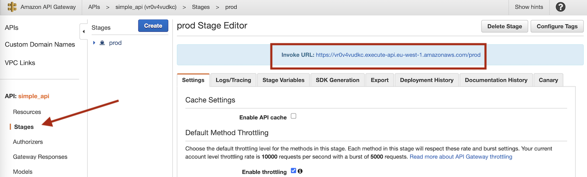
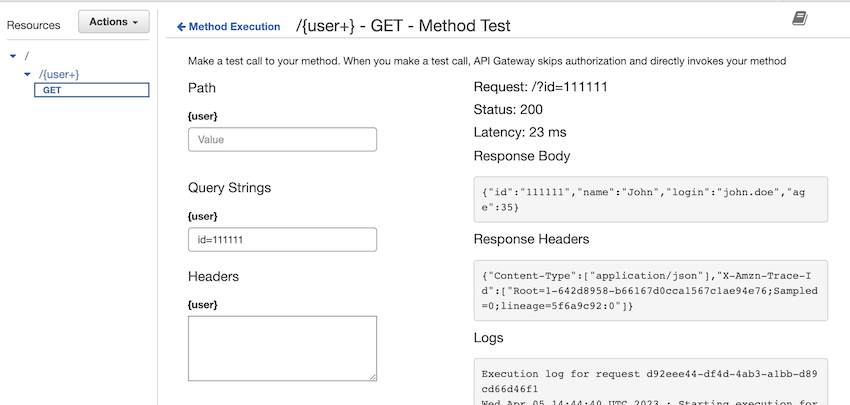

### Goals
The objective is to build an API served by API-gateway and with some lambdas listening

 - [X] Add a simple method GET that accepts a query parameter and returns an entity
 - [ ] Add a POST method to put some data in the DB (DB is mocked, so I will just console.log it)
 - [ ] Add authentication?
 - [X] Add some different error types in the return (403, 402...)
 - [X] Add tool to document REST calls [1]
 - [X] Open the API so it is accessible from internet [2]

[1] Requests added to the `request` folder using REST Client extension
[2] Here is the way of obtaining the `URL` to request the API, as it changes in each deployment

### Example execution

### Bibliography
- https://www.youtube.com/watch?v=uFsaiEhr1zs&t=1s
- https://www.youtube.com/watch?v=5VikkwAxr-E (1/2)
- https://www.youtube.com/watch?v=M91vXdjve7A (2/2)
- https://www.bogotobogo.com/DevOps/AWS/aws-API-Gateway-Lambda-Terraform.php
- https://stackoverflow.com/questions/56071536/why-is-the-method-response-of-an-api-gateway-different-when-being-created-using