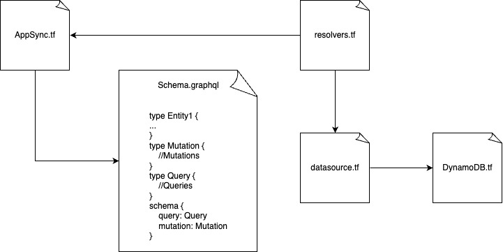
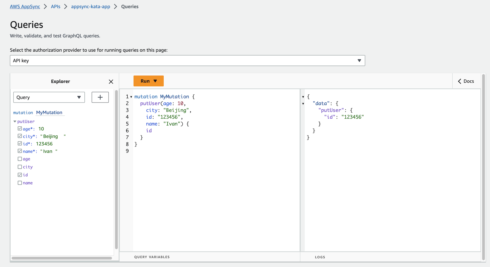
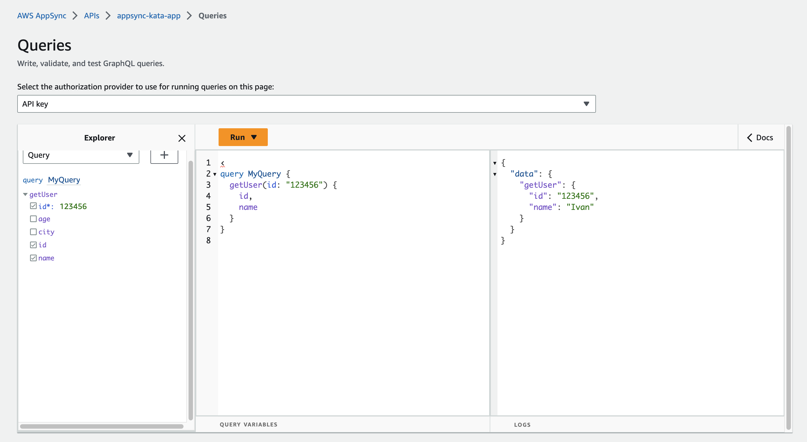
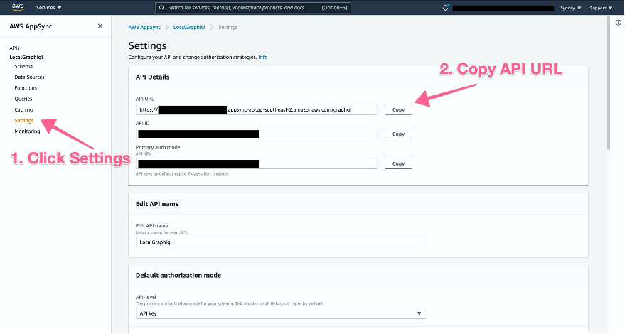

### Goals
- [X] Create Graphql endpoint
- [X] Add 2 different data-sources
- [X] Add a cURL example of how to call that endpoint
- [ ] Create a subscription/websocket endpoint to receive notifications
### Description
This is a graphql API exposing different datasources: a dynamoDB collection, some RDS tables...
The AWS service to achieve this is AWS AppSync. The idea behind graphql is to expose one single endoint that the client is gonna use with a SQL-ish language to query/store data.

AWS AppSync requires a description of the schema in graphql: how are the entities defined and how are the operations we can perform over them. If the operation is a getter it is called <b>resolver</b> and if it modifies some data in the datasource it is called <b>mutator</b>
We need to define how these resolvers and mutators are, and I define it in the resolvers.tf file. In the case of modifying the database datasource it is pretty straightforward, as it just passes the data we receive in the query, so there is no extra computation in the middle.

Another very important feature of AWS AppSync is that it can connect different datasources at the same time and serve complex queries mixing data from several of them at the same time. It can work with dynamodb, auroraDB, and lambda... so from lambda we can connect with any other AWS service really.

### Calling the endpoint from AWS console 
Using the AWS console you can query/mutate data, example:

### Calling the endpoint from cURL/REST client
Although the idea of graphql is to be used with a graphql client like Apollo to handle the queries, it is possible to call directly to the endpoint using <i>cURL</i> or the VSCode extension <i>REST Client</i>. I have an example of call in the <i>/requests</i> folder. Only 2 things to replace in that call are:
- APPSYNC-URL: to be replaced with the AppSync API endpoint URL that can be found accessing the Appsync section in the AWS console. Then in 'Settings' we can get it from the 'GraphQL endpoint'
- API-KEY: Can be found in the same 'Settings' screen as above.

### Resources
- AWS AppSync Introduction: https://www.youtube.com/watch?v=O-nr3983-ZY