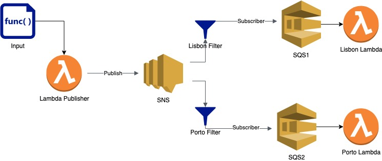
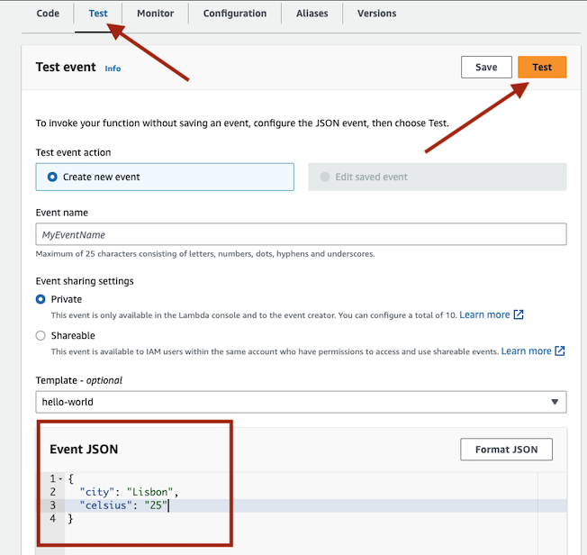

### Goals
- [X] Implement a SNS => SQS architecture with lambdas listening at the end of each queue.
- [X] Logging: set up a logging system and try to centralise
- [X] Graphic architecture tool to create diagrams [1]
- [ ] Investigate how to set N lambda instances listening at the same SQS in case it needs to scale up horizontally
- [ ] Create via terraform a cloudwatch monitor
 
[1] Using diagrams.net (before draw.io)
### Description
This scenario implements te fanout pattern [2] where one lambda sends a message to a SNS publisher and that message gets spread to different SQSs so it can be processed in parallel. Here is a diagram of the architecture:

The system emulates a weather application that publishes messages about weather and then we process them in different queues. Using SNS filters the SQS select which messages are interested in. The message delivered is gonna be the weather in a specific town `(city, datetime, celsius)`.
So one lambda is gonna read messages for the city of `Lisbon` and the other one will only read messages for `Porto`. If the reading is for `Portugal` then it gets delivered to both queues/lambdas

### How to run
first of all you have to compile and bundle the lambdas so they can be deployed. To do that, run in the root dir of this project
`yarn build`
after this, go to the infra folder and run `terraform init`, `terraform plan` and `terraform apply`
Once deployed, you can go to the publisher lambda in aws and send a new message as shown here:

### Resources
[2] https://docs.aws.amazon.com/sns/latest/dg/sns-common-scenarios.html
- SNS vs SQS vs EventBridge: https://www.youtube.com/watch?v=RoKAEzdcr7k
- https://serverlessland.com/patterns/sns-sqs-terraform
- https://medium.com/appetite-for-cloud-formation/setup-lambda-to-event-source-from-sqs-in-terraform-6187c5ac2df1
- https://advancedweb.hu/how-to-target-subscribers-in-an-sns-topic/