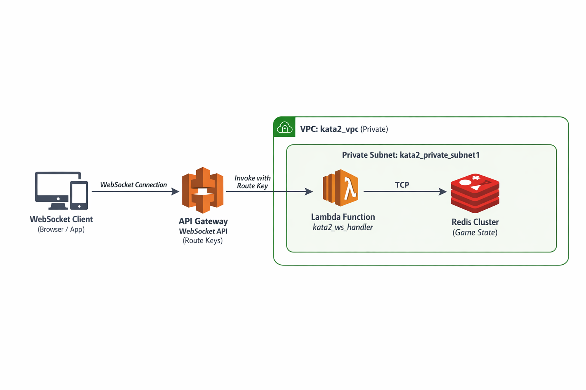

The idea of this kata is to implement a Websocket server behind AWS gateway to accept connections from 2 players
of tic-tac-toe. 2 people will be able to communicate with the server, that will store games in REDIS. The computing
piece behind the Gateway is gonna be a lambda that respond for the WS messages of all the games.
The frontend will be implemented in NextJS and deployed in AWS Amplify (no vercel or netlify).

Gateway → keeps connections open
Lambda → stateless game logic. It receives route keys from clients and performs the operations in memory (Redis)
Redis → cheap, fast, shared memory for game state



<h3>Introduction</h3>
While HTTP (REST) is a synchronous and unidirectional communication; Websockets are asynchronous and bidirectional. Another big difference is that HTTP is stateless: when the request is responded the connection is closed, while WS keep a stateful connection open. 

In this game the clients can connect at any time and send any request, but I will ignore those that does not make sense. For example if you are in a game and try to create another one, this last request will be ignored.

REST API: (HTTP is a request/response protocol at the application layer.)
 - Request/Response model — client sends request, waits for response, connection closes
 - Synchronous — client blocks until response arrives
 - Unidirectional — only server responds to client requests 
 - Stateless — each request is independent
 - Use case: CRUD operations, data fetching
Example:

```
Client: GET /games → waits
Server: [game1, game2, game3] → connection closes
```

WebSocket: (WebSockets are best described as a full-duplex, message-oriented, persistent protocol. NO request/response and NO application level ack, WE need to implement it if we want it)
- Persistent, bidirectional stream — connection stays open
- Asynchronous — client sends and doesn't wait for response
- Bidirectional — both client and server can send anytime
- Stateful — maintains connection state
- Use case: Real-time apps (games, chat, notifications)
WebSockets do NOT provide automatic application-level acknowledgments. You must send explicit messages back to the client if you want feedback. It
is not like HTTP connections that wait for a response. Here you have to sxplicitly send the response from the server.
Example:

```
Client: { op: "create" } → doesn't wait
Server: { gameId: "123" } → connection still open
Client: { op: "list" } → anytime
Server: [game123, game456] → anytime
Server: { board: [...] } → unsolicited push (from other player's move)
```

The main difference between HTTP and WS is that HTTP is synchronous and waits for a response from the server, so if the message is lost or processing fails, the client gets an error immediately. In WS, the client sends a message and doesn't wait for a response—it only receives a TCP-level acknowledgment that the data arrived at the network level. We don't know by default if the server processed the message successfully or if it failed. If we want application-level feedback, we must have the server explicitly send a response message back to the client.

<h3>Instructions</h3>
In order to compile the rust code it is needed the package cargo-lambda
`cargo install cargo-lambda`

The websocket connection can be tested with: https://websocketking.com/

<h3>List of WS Custom route keys</h3>

lists the current games waiting for participant
```
{
    op: "list"
}
---
{
    games: ["111", "222"]
}
```
Create a new game
```
{
    op: "create"
}
---
{
    id: "111"
}
```
Note: the id of the game it is gonna be the connection ID of the creator. i.e: "connectionId": "YkFNQccvAi0CETA="

Join game
```
{
    op: "join",
    id: "111"
}
---
{  
    status: "ok" | "error"
    message: "Success" | "Game not found"
}
```
Move
```
{
    row: 1,
    col: 2
}
---
{
    status: "ok" | "error"
    message: "Moved" | "Game ended, player 1 won" | "Game ended, draw"  "Invalid move, repeat" | "It's not your turn"
}
```
